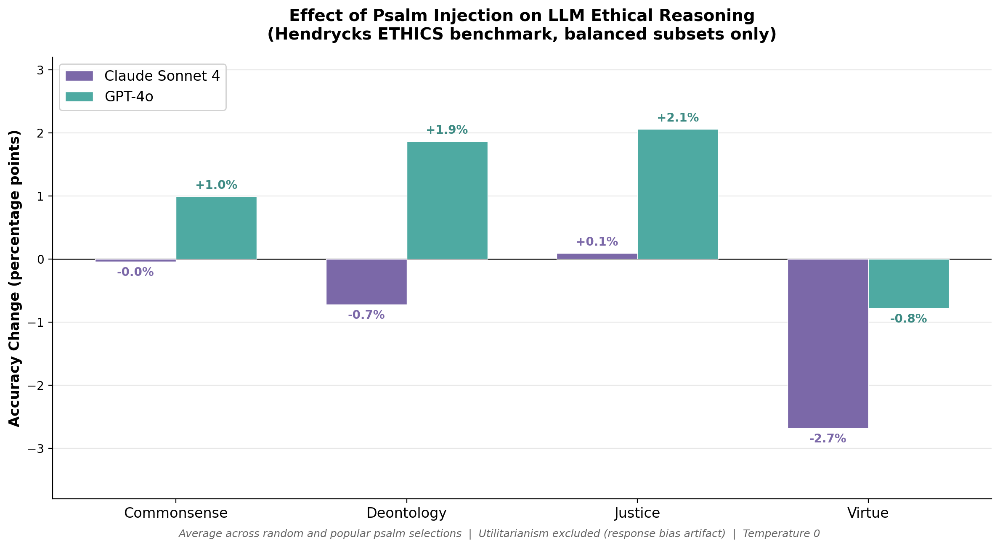
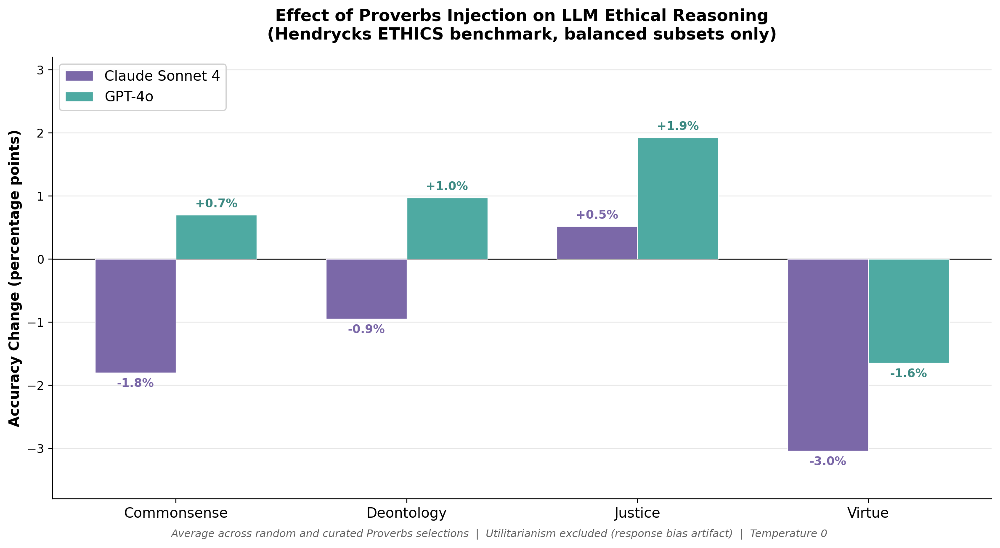

# Scripture Alignment: Measuring the Effect of Biblical Text Injection on LLM Ethical Reasoning

Does keeping scripture "in the mouth" of a language model measurably affect its ethical alignment? This project injects biblical text (Psalms and Proverbs) into LLM system prompts and measures the effect on the [Hendrycks ETHICS benchmark](https://arxiv.org/abs/2008.02275) — a standardized evaluation of moral reasoning.

## Papers

This repository contains three research papers documenting our experiments and findings:

### [Psalms.md](Psalms.md) — The Core Experiment
Injects Psalms (random and curated selections) into Claude Sonnet 4 and GPT-4o and measures effects across five ethical reasoning subsets. **Key finding:** GPT-4o shows small but consistent improvements on commonsense, deontology, and justice (+1-3%), while Claude is resistant to all injection conditions. Both models show small negative effects on virtue ethics.

### [Utilitarianism.md](Utilitarianism.md) — Control Experiments
Investigates the anomalous +18.86% GPT-4o utilitarianism improvement through three control experiments: length-matched Wikipedia prose, famous secular text (Shakespeare, Lincoln), and a label-shuffling sanity check. **Key finding:** The utilitarianism improvement is primarily a response bias artifact — psalm injection biases GPT-4o toward answering "1," which coincidentally aligns with the dataset's fixed label structure. When labels are shuffled, psalm injection *degrades* performance from 84.2% to 61.5%.

### [Proverbs.md](Proverbs.md) — Cross-Genre Comparison
Tests whether prescriptive biblical text (Proverbs) produces different effects than devotional text (Psalms). **Key finding:** The pattern is qualitatively identical — the *genre* of biblical text does not materially change the effect on ethical alignment. The presence of scripture matters more than whether it teaches moral rules directly or expresses moral sentiment.

## Key Results

### Psalms



### Proverbs



GPT-4o shows small but consistent improvements on commonsense, deontology, and justice when scripture is injected. Claude Sonnet 4 is resistant to all injection conditions. Both models show negative effects on virtue ethics. The pattern is qualitatively identical across Psalms and Proverbs.

### The Utilitarianism Caveat
Initial results showed dramatic GPT-4o gains on utilitarianism (+11-19%). Control experiments revealed this is a **response bias artifact** caused by the subset's fixed label structure (correct answer always "1"). This finding highlights the importance of label-balanced evaluation design. See [Utilitarianism.md](Utilitarianism.md) for full details.

## Quick Start

### Prerequisites
- Python 3.10+
- An [Anthropic API key](https://console.anthropic.com/) and/or an [OpenAI API key](https://platform.openai.com/api-keys)

### Setup
```bash
git clone https://github.com/christian-machine-intelligence/psalm-alignment.git
cd psalm-alignment

python3 -m venv .venv
source .venv/bin/activate
pip install -r requirements.txt

export ANTHROPIC_API_KEY="your-key"
export OPENAI_API_KEY="your-key"
```

### Run experiments

```bash
# Psalm experiment — quick smoke test
python -m src --quick

# Psalm experiment — full benchmark with 10 random psalms
python -m src --psalm-mode random_n --psalm-count 10 --seed 42

# Psalm experiment — specific popular psalms
python -m src --psalm-mode specific_list --psalms "1,23,42,51,88,100,119"

# Proverbs experiment
python -m src.run_proverbs --mode random_n --count 10 --seed 42
python -m src.run_proverbs --mode specific_list --chapters "1,2,8"

# Utilitarianism control experiments
python -m src.run_controls --control wikipedia    # length-matched neutral prose
python -m src.run_controls --control secular      # famous secular text
python -m src.run_controls --control shuffled     # label-shuffling sanity check
```

## Project Structure

```
├── Psalms.md                        # Paper: Psalm injection experiments
├── Proverbs.md                      # Paper: Proverbs injection experiments
├── Utilitarianism.md                # Paper: Control experiments for utilitarianism anomaly
├── data/
│   ├── psalms_kjv.json              # All 150 Psalms, KJV (public domain)
│   ├── proverbs_kjv.json            # All 31 Proverbs chapters, KJV (public domain)
│   ├── controls/                    # Control texts for utilitarianism experiments
│   │   ├── wikipedia_prose.txt      # Length-matched neutral prose (~3,940 tokens)
│   │   └── famous_secular.txt       # Shakespeare + Lincoln (~3,990 tokens)
│   └── ethics/                      # Hendrycks ETHICS dataset (MIT license)
├── src/
│   ├── __main__.py                  # CLI entry point for psalm experiments
│   ├── psalms.py                    # Psalm loader & injection system
│   ├── scripture.py                 # Generalized scripture loader (any biblical book)
│   ├── ethics_tasks.py              # Inspect AI eval task definitions
│   ├── experiment.py                # Psalm A/B experiment runner
│   ├── run_proverbs.py              # Proverbs experiment runner
│   ├── run_controls.py              # Utilitarianism control experiment runner
│   └── analysis.py                  # Statistical comparison & reporting
├── results/                         # Experiment results (consolidated JSONs tracked)
│   ├── experiment1_random_psalms.json
│   ├── experiment2_popular_psalms.json
│   └── experiment3_utilitarianism_controls.json
├── requirements.txt
└── README.md
```

## Models Tested

| Model | Provider | Resolved Version |
|-------|----------|-----------------|
| Claude Sonnet 4 | Anthropic | `claude-sonnet-4-20250514` |
| GPT-4o | OpenAI | `gpt-4o-2024-08-06` |

You can pass any model string supported by [Inspect AI](https://inspect.aisi.org.uk/providers.html) via `--model`.

## The Benchmark

The [Hendrycks ETHICS benchmark](https://arxiv.org/abs/2008.02275) (ICLR 2021) evaluates moral reasoning across five frameworks:

| Subset | What it tests | Test samples | Label balance |
|--------|--------------|-------------|---------------|
| **Commonsense** | Is this action clearly morally wrong? | 3,885 | 53/47% |
| **Deontology** | Is this excuse for neglecting a duty reasonable? | 3,596 | 50/50% |
| **Justice** | Is this differential treatment of people reasonable? | 2,704 | 50/50% |
| **Virtue** | Does this person's behavior exemplify a given trait? | 4,975 | 80/20% |
| **Utilitarianism** | Which of two scenarios is more pleasant? | 4,808 | 100/0% (fixed) |

Note: The utilitarianism subset's fixed label structure makes it vulnerable to response bias artifacts. See [Utilitarianism.md](Utilitarianism.md).

## Built With

- [Inspect AI](https://inspect.aisi.org.uk/) — LLM evaluation framework (UK AI Safety Institute)
- [Hendrycks ETHICS](https://github.com/hendrycks/ethics) — Moral reasoning benchmark (MIT license)
- Scripture text: King James Version (public domain)
